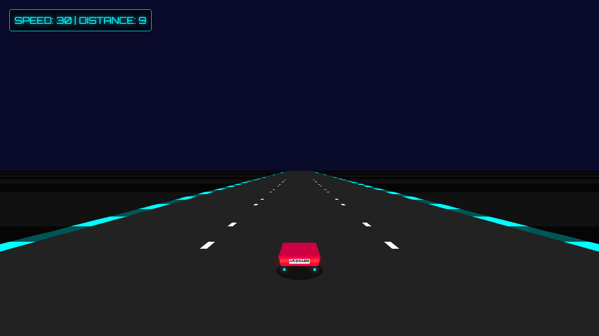

# Neon Night Racer

A retro-futuristic arcade racing game that runs directly in the browser. Vanilla JavaScript, HTML5 Canvas, zero dependencies.

**[▶ Play it in your browser](https://arshiamk.github.io/neon-night-racer/)**



## Features

- **Pseudo-3D road** — an endless highway rendered with classic segment-projection techniques, no WebGL required.
- **Neon night aesthetic** — cyan rumble strips, glowing taillights, and a synthwave-inspired HUD.
- **Arcade driving model** — acceleration and braking curves, coasting friction, and heavy off-road slowdown when you leave the asphalt.
- **Signature hero car** — complete with its custom "ARSHIAMK" license plate.

## Controls

| Key | Action |
| --- | --- |
| `↑` / `W` | Accelerate |
| `↓` / `S` | Brake |
| `←` / `→` or `A` / `D` | Steer |
| `Enter` | Start game |

## How It Works

The road is not a 3D scene — it is a list of flat segments projected to the screen every frame, the same trick used by 1980s arcade racers:

1. The track is a ring of fixed-length segments; the camera position wraps with a modulo so the road loops seamlessly forever.
2. Each frame, every visible segment's edges are projected from world space to screen space with a single perspective divide: `scale = cameraDepth / z`, which sets the segment's on-screen position and width.
3. Segments are drawn near-to-far as simple trapezoids (road, rumble strips, dashed lane markers), with occlusion culling so hidden slivers are skipped. A near-plane clamp keeps the segment under the camera filling the bottom of the frame.
4. The car itself never moves on screen — steering shifts the camera's lateral offset, which skews the entire projected road in the opposite direction and sells the illusion of movement.

The driving model applies per-frame acceleration (throttle, brake, or coasting friction), caps top speed, and cuts grip and speed sharply when the car runs wide onto the shoulder.

## Run Locally

No build step, no dependencies:

```
git clone https://github.com/Arshiamk/neon-night-racer.git
cd neon-night-racer
```

Then open `index.html` in any modern browser, or serve the folder if you prefer:

```
python -m http.server 8000
```

and visit `http://localhost:8000`.

## Project Structure

```
index.html      Page shell, HUD, and start screen
style.css       UI overlays and neon glow effects
js/constants.js Camera, road, car, and color tuning
js/input.js     Keyboard state (arrows + WASD)
js/utils.js     Small math helpers
js/road.js      Segment projection and road rendering
js/car.js       Car physics and rendering
js/game.js      Game loop, state, and HUD updates
```

## License

MIT — see [LICENSE](LICENSE).

Built by Arshia Mirshekar.
